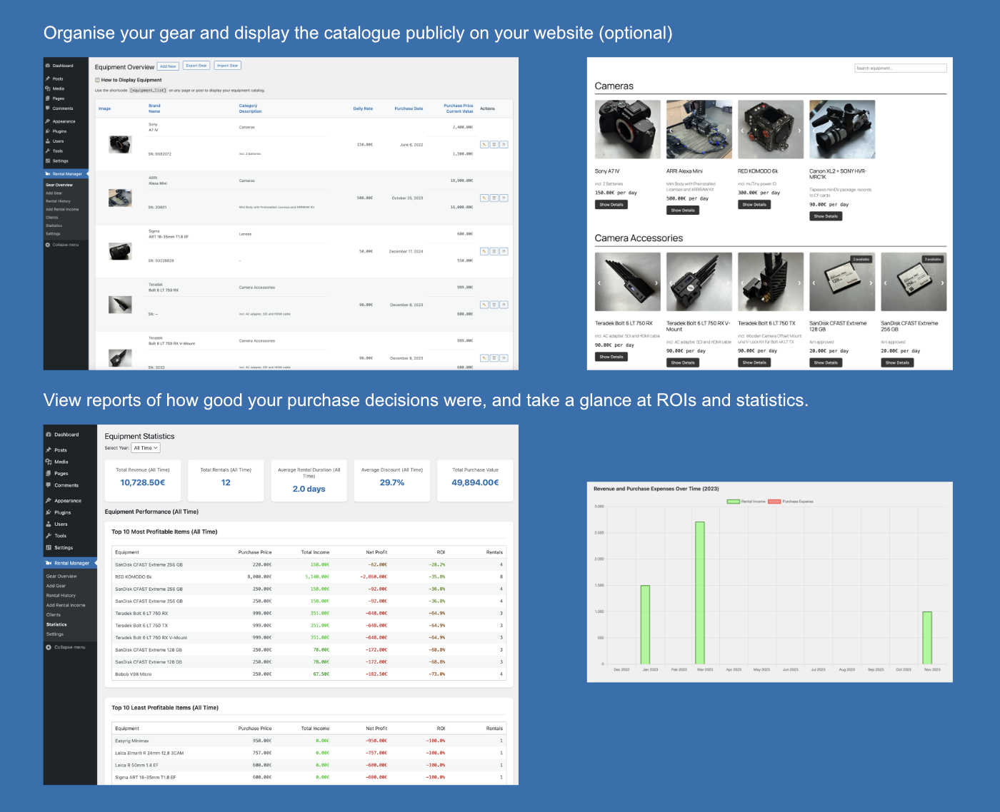

# Film Equipment Rental Wordpress Plugin

## Purpose

A WordPress plugin for filmmakers to track ROI on their equipment rentals. Created to solve the common issue of not knowing whether gear investments are actually profitable, helping to make more informed purchasing decisions.



## Key Features

### Equipment Management
- Track gear details (purchase price, current value, daily rate)
- Organize by categories and brands
- Quick inline editing with double-click
- Bulk actions (duplicate, delete)
- Import/Export as JSON
- Serial number tracking
- Image management

### Rental Tracking
- Track rental sessions and earnings
- Package deal support
- Client management
- Individual item vs package pricing
- Automatic discount calculation
- PDF rental sheet generation

### Financial Analysis
- ROI tracking per item
- Revenue statistics
- Most/least profitable items
- Monthly trends
- Client revenue tracking
- Purchase value vs rental income

### Frontend Display
- Public equipment catalog via shortcode `[equipment_list]`
- Searchable/filterable interface
- Category grouping
- Technical specs formatting
- Lightbox image viewing
- Optional pagination

## Installation

1. Download the latest stable release from the [GitHub releases page](https://github.com/JensS/Film-Equipment-Rental/releases).
2. Upload the plugin files to `/wp-content/plugins/gear` or use the WordPress plugin upload feature.
3. Activate the plugin through the 'Plugins' screen in WordPress.
4. Configure settings under "Equipment Rental".

## Updating

The plugin supports automatic updates from the GitHub repository. It will check for updates and install them automatically.

## Settings

### General
- Currency (symbol and position)
- Date format
- Items per page
- Category grouping
- Pagination
- Similar items grouping

### Data Management
- Import/Export equipment data
- Import/Export rental history
- Import/Export client data
- Reset database (CLI)

## CLI Commands

```bash
# Reset plugin data
wp fer_reset

# Import sample data
wp fer_example_data

# Import from JSON
wp fer_import_gear /path/to/gear.json
wp fer_import_rentals /path/to/rentals.json
wp fer_import_clients /path/to/clients.json
```

## Technical Specifications

Equipment descriptions support two formats:

```
# Space-separated
Focal Length 16mm Maximum Aperture T2.8

# Colon-separated
Focal Length: 16mm
Maximum Aperture: T2.8
```

## About

Created by Jens Sage ([www.jenssage.com](https://www.jenssage.com)) to help filmmakers make better gear investment decisions.


